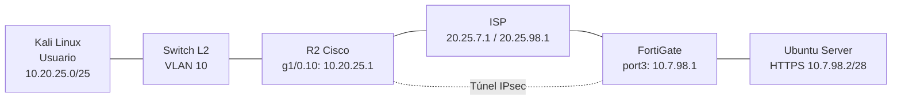

# VPN IPsec Site-to-Site: FortiGate y router Cisco

Laboratorio de Seguridad de Redes (Infraestructura 2): comunicación segura entre un usuario y un servidor web HTTPS a través de una VPN IPsec Site-to-Site entre un **FortiGate** (configurado por GUI) y un **router Cisco IOS**, equipos de fabricantes distintos.

## Propósito del laboratorio

Comunicar a un usuario (Kali Linux, en la VLAN 10, detrás del router Cisco) con un servidor web (Ubuntu Server con Apache2 y HTTPS, detrás del FortiGate) a través de un enlace VPN IPsec Site-to-Site, usando un ISP con direcciones IP públicas.

El ISP no conoce las redes privadas, por lo que el tráfico entre el usuario y el servidor solo tiene camino cuando el túnel VPN está activo. Todo el direccionamiento se construyó a partir de la matrícula 20250798.

### Objetivos

- Comunicar el usuario con el servidor a través del enlace VPN.
- Configurar en el FortiGate (todo por GUI): interfaces, rutas, NAT y VPN Site-to-Site.
- Configurar en el router Cisco: interfaces, subinterfaz VLAN 10, DHCP, NAT y VPN Site-to-Site.
- Configurar el ISP con IP públicas.
- Publicar un servidor web con HTTPS en una red /28.
- Configurar la red de usuarios /25 en VLAN 10 con DHCP y verificar la ruta con traceroute.

---

## Topología

Port1 del FortiGate está conectado a un nodo Cloud y se usa solo para acceder a su GUI.

## Direccionamiento

| Enlace / Red | Red | Extremo A | Extremo B |
|---|---|---|---|
| ISP - R2 | 20.25.7.0/30 | ISP f0/0: 20.25.7.1 | R2 f0/0: 20.25.7.2 |
| ISP - FortiGate | 20.25.98.0/30 | ISP g1/0: 20.25.98.1 | FortiGate port2: 20.25.98.2 |
| LAN usuarios (VLAN 10) | 10.20.25.0/25 | R2 g1/0.10: 10.20.25.1 | Kali: DHCP (.10 a .100) |
| LAN servidor | 10.7.98.0/28 | FortiGate port3: 10.7.98.1 | Ubuntu Server: 10.7.98.2 |

## Tecnologías

GNS3, VMware, FortiGate VM 7.0.9, Cisco IOS, Kali Linux, Ubuntu Server, Apache2.

---

## Qué se configuró

- **ISP:** direccionamiento público en f0/0 y g1/0.
- **R2 (Cisco, CLI):** interfaz WAN, subinterfaz `g1/0.10` con `dot1Q 10` como gateway de los usuarios, servidor DHCP, NAT de salida con una ACL que excluye el tráfico de la VPN, y VPN IPsec con crypto map.
- **FortiGate (GUI):** interfaces WAN y LAN, ruta por defecto por port2, política de salida con NAT, políticas de VPN sin NAT y túnel IPsec hacia R2.
- **Servidor:** IP estática con Netplan y HTTPS habilitado en Apache2.
- **Usuario:** Kali Linux conectado a un switch con el puerto en access VLAN 10 y un trunk 802.1Q hacia R2, con IP por DHCP.

## Parámetros de la VPN

| Parámetro | FortiGate | R2 (Cisco) |
|---|---|---|
| IP del peer | 20.25.7.2 | 20.25.98.2 |
| IKE | IKEv1, Main | IKEv1, Main |
| Autenticación | Pre-shared key | Pre-shared key |
| Fase 1 | DES / SHA1 / DH 5 / 86400 s | DES / SHA1 / DH 5 / 86400 s |
| Fase 2 | des-sha1 | esp-des esp-sha-hmac |
| Selector local | 10.7.98.0/28 | 10.20.25.0/25 |
| Selector remoto | 10.20.25.0/25 | 10.7.98.0/28 |

> El FortiGate VM utilizado solo ofrece DES en las propuestas de cifrado, por lo que el túnel se configuró con DES/SHA1/DH 5. Esto es suficiente para el laboratorio, pero en producción se usaría AES con SHA256.

## Pruebas

- Con el túnel activo, el `traceroute 10.7.98.2` desde Kali llega al servidor: primer salto R2 (`10.20.25.1`), segundo salto sin respuesta (tráfico dentro del túnel) y tercer salto el servidor.
- Un ping de R2 que no coincide con la ACL de la VPN no entra al túnel, y el ISP responde *destination unreachable*, porque no tiene ruta hacia las redes privadas.
- En el FortiGate, el tráfico de `10.20.25.1` hacia el servidor entra por el túnel y es permitido por la política VPN hacia la LAN del servidor.

Las capturas de cada prueba están en el PDF de documentación.

## Problemas encontrados y soluciones

1. **El FortiGate solo ofrece DES.** El asistente dejó propuestas con DES y el editor de la fase 1 solo permite DES. Solución: adaptar R2 a DES con SHA1 y grupo DH 5 para que ambos peers compartan propuesta.
2. **Ruta por defecto recibida por DHCP en port1.** Port1 (DHCP, solo gestión) instalaba un gateway con distancia 5, menor que la ruta estática por port2 (10). Solución: desactivar *Retrieve default gateway from server* en port1.

## Archivos de configuración

| Archivo | Descripción |
|---|---|
| `R2-config.txt` | Configuración del router Cisco R2 (clave precompartida oculta) |
| `ISP-config.txt` | Configuración del ISP |
| `netplan-ubuntu-infra2.yaml` | IP estática del servidor web |
| `FortiGate-config.conf` | Backup del FortiGate exportado desde la GUI (claves ocultas) |

> No se usaron scripts automatizados. El FortiGate se configuró por GUI y el resto de equipos con los archivos de configuración de este repositorio.

---

**Autor:** Emmanuel Orlando Rodríguez Núñez - 20250798
**Materia:** Seguridad de Redes
